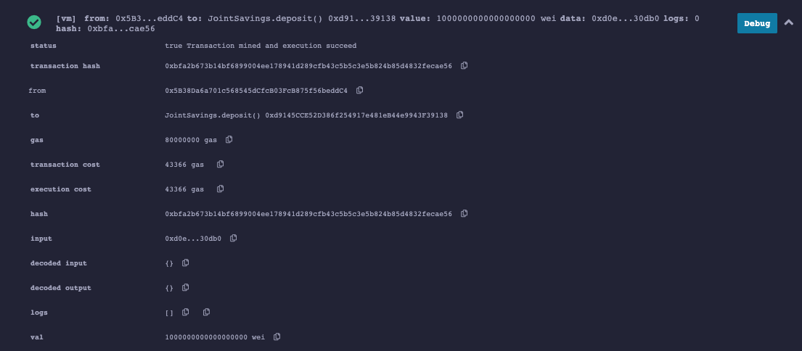
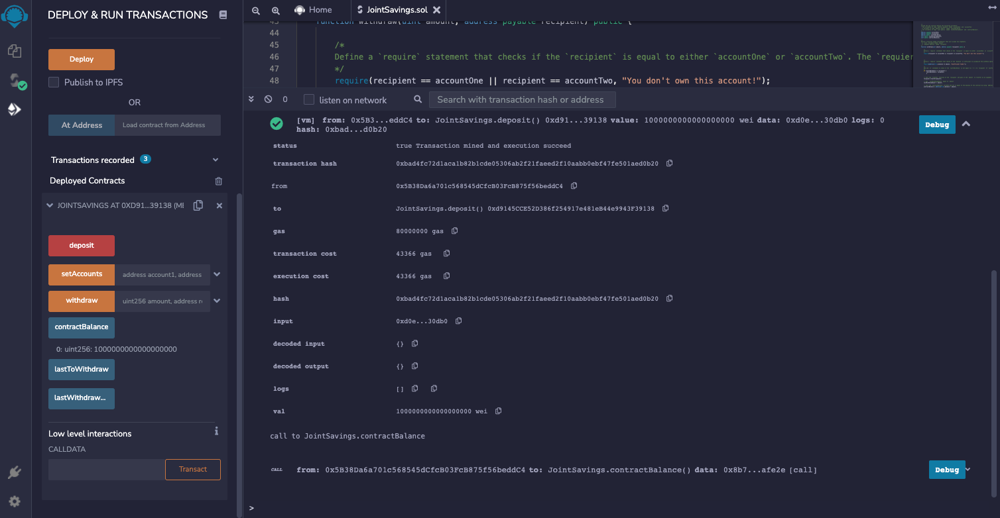
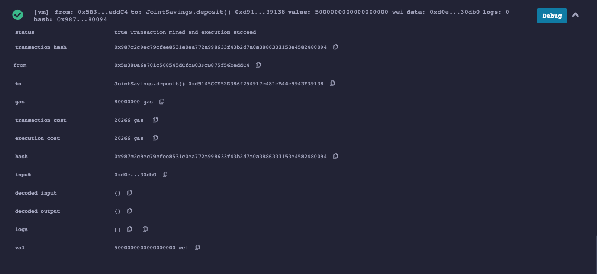
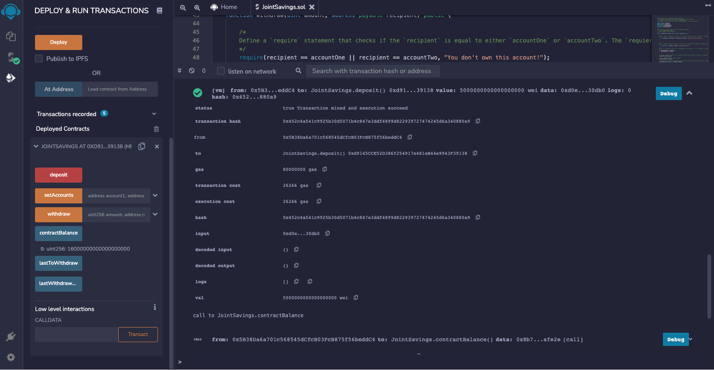
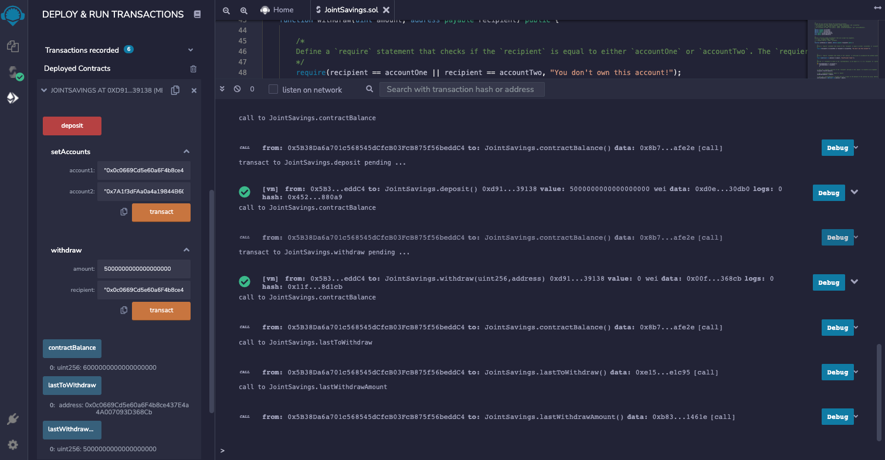
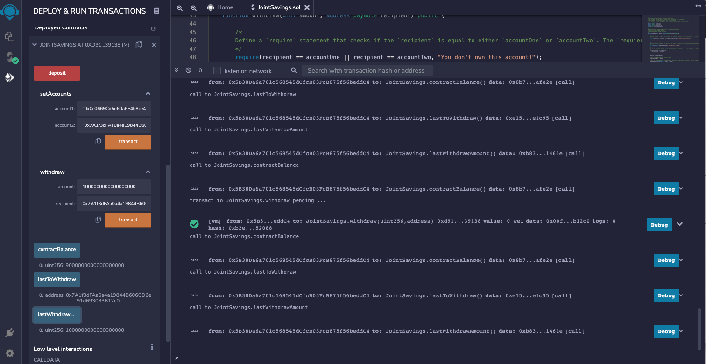

# Joint_Bank_Account

Automate the creation of joint savings accounts and create a Solidity smart contract that accepts two user addresses. These addresses will be able to control a joint savings account.

## Create a Joint Savings Account Contract in Solidity

## Define the authorized Ethereum address that will be able to withdraw funds from your contract.
Dummy account1 address: 0x0c0669Cd5e60a6F4b8ce437E4a4A007093D368Cb
Dummy account2 address: 0x7A1f3dFAa0a4a19844B606CD6e91d693083B12c0

## Test the deposit functionality of the smart contract by sending the following amounts of ether. After each transaction, use the contractBalance function to verify that the funds were added to your contract:

### Transaction 1: Send 1 ether as wei.

### Transaction 2: Send 10 ether as wei.

### Transaction 3: Send 5 ether.

## Withdrawal from account 1

## Withdrawal from account 2
